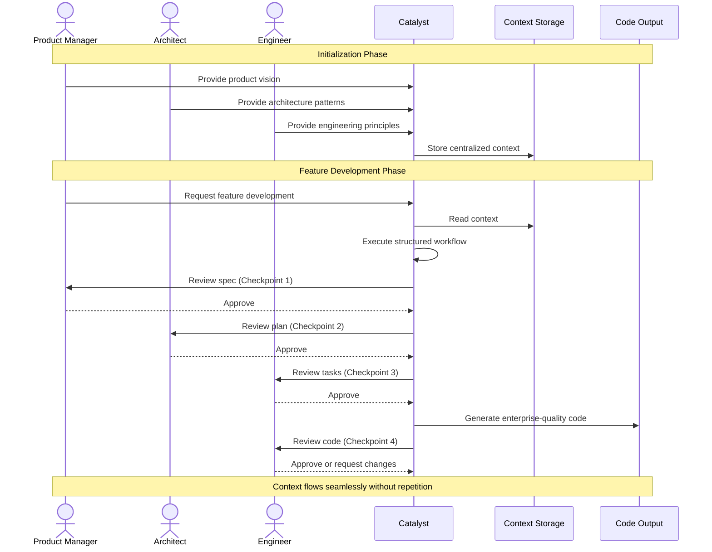

# Customer Journey

Product-level workflow showing how actors interact with Catalyst through the feature development lifecycle.

```mermaid
sequenceDiagram
    actor PM as Product Manager
    actor Arch as Architect
    actor Eng as Engineer
    participant Cat as Catalyst
    participant Ctx as Context Storage
    participant Code as Code Output

    Note over PM,Code: Initialization Phase
    PM->>Cat: Provide product vision
    Arch->>Cat: Provide architecture patterns
    Eng->>Cat: Provide engineering principles
    Cat->>Ctx: Store centralized context

    Note over PM,Code: Feature Development Phase
    PM->>Cat: Request feature development
    Cat->>Ctx: Read context
    Cat->>Cat: Execute structured workflow

    Cat->>PM: Review spec (Checkpoint 1)
    PM-->>Cat: Approve

    Cat->>Arch: Review plan (Checkpoint 2)
    Arch-->>Cat: Approve

    Cat->>Eng: Review tasks (Checkpoint 3)
    Eng-->>Cat: Approve

    Cat->>Code: Generate enterprise-quality code
    Cat->>Eng: Review code (Checkpoint 4)
    Eng-->>Cat: Approve or request changes

    Note over PM,Code: Context flows seamlessly without repetition
```
