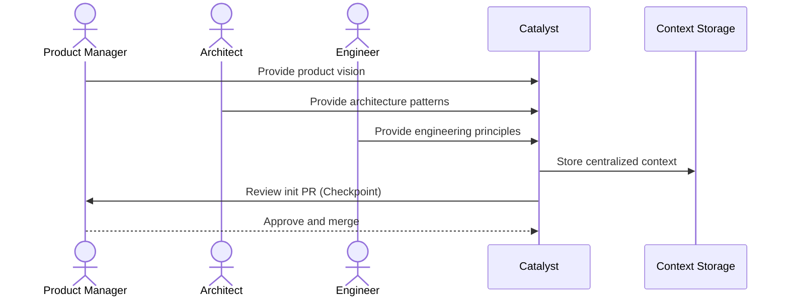
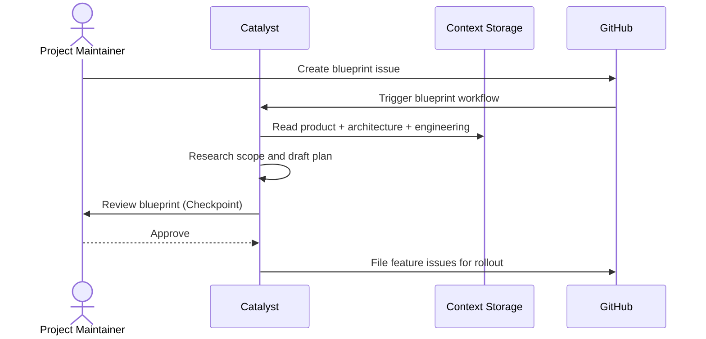
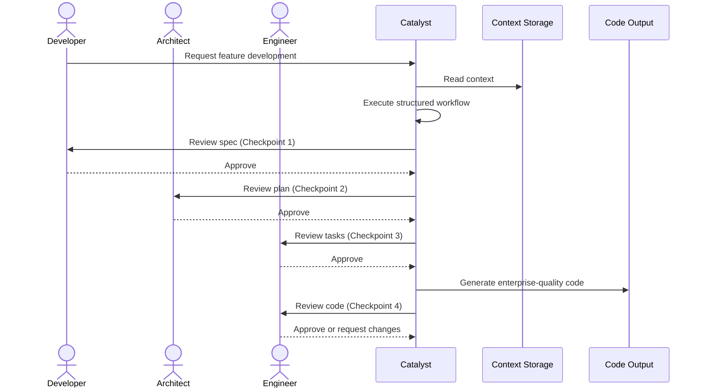

# Customer Journey

Product-level workflows showing how actors interact with Catalyst across distinct phases of the feature development lifecycle. Each journey captures a named workflow with its triggering actors, key checkpoints, and expected outcomes.

## Initialization

Triggered when a Project Maintainer starts a new project with Catalyst. The Product Manager, Architect, and Engineer contribute their respective context files, which Catalyst consolidates into centralized project context the AI Agent reads on every future workflow run.

## Blueprint Build-out

Triggered when a Project Maintainer creates a blueprint issue to plan a program of work. Catalyst researches the request, drafts a spec and rollout plan, and guides the team through review checkpoints before the blueprint is converted into feature issues for downstream implementation.

## Feature Development

Triggered when a Developer requests feature work. Catalyst reads project context, executes a structured workflow with approval checkpoints at spec, plan, and review phases, then delivers enterprise-quality code with passing tests and requirements traceability.

