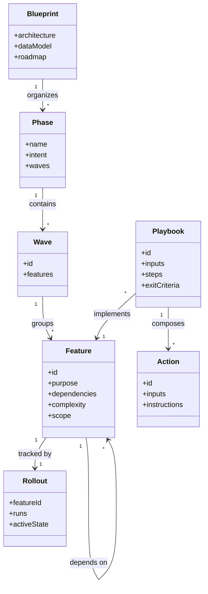

# Blueprint: Catalyst

<!-- markdownlint-disable single-title -->

## Architecture

```mermaid
graph TD
  subgraph context[Context]
    pc[product-context]
    ec[engineering-context]
    fc[feature-context]
    bc[blueprint-context]
    wc[workflow-context]
    cs[context-storage]
    fc --> pc
    fc --> ec
    bc --> pc
    wc --> cs
  end

  subgraph engine[Workflow Engine]
    eh[error-handling]
    pd[playbook-definition]
    py[playbook-yaml]
    pte[playbook-template-engine]
    pe[playbook-engine]
    pas[playbook-actions-scripts]
    pai[playbook-actions-io]
    pac[playbook-actions-controls]
    pag[playbook-actions-github]
    paa[playbook-actions-ai]
    log[logging]
    rt[req-traceability]
    fl[feedback-loop]
    py --> pd
    pte --> pd
    pe --> pd
    pe --> pte
    pe --> eh
    pas --> pd
    pai --> pd
    pac --> pd
    pag --> pd
    paa --> pd
  end

  subgraph providers[AI Providers]
    ap[ai-provider]
    apc[ai-provider-claude]
    apco[ai-provider-copilot]
    apcu[ai-provider-cursor]
    apg[ai-provider-gemini]
    apo[ai-provider-ollama]
    apoa[ai-provider-openai]
    apc --> ap
    apco --> ap
    apcu --> ap
    apg --> ap
    apo --> ap
    apoa --> ap
  end
  paa --> ap

  subgraph workflows[Workflows]
    iw[init-workflow]
    bw[blueprint-workflow]
    fw[feature-workflow]
    prw[pull-request-workflow]
    iw --> pc
    iw --> ec
    bw --> bc
    bw --> pe
    fw --> fc
    fw --> pe
    prw --> pe
  end

  subgraph dist[Distribution]
    cli[catalyst-cli]
    cli --> pe
    cli --> iw
    cli --> bw
    cli --> fw
  end
```

## Data Model

## Roadmap

```mermaid
gantt
  title Roadmap
  dateFormat X
  axisFormat %s
  section POC
    foundation     :poc, 0, 1
    workflows      :poc2, after poc, 1
    cli            :poc3, after poc2, 1
  section Mainstream
    autonomy       :main, after poc3, 1
  section Innovation
    autoreviews    :inn, after main, 1
    conversational :inn2, after inn, 1
  section Platform
    extensibility  :plat, after inn2, 1
  section Enterprise
    scale          :ent, after plat, 1
```

### Phase 1: POC — Prove the concept works

_Strategic intent: ship a complete spec-driven workflow with multi-platform AI support and a CLI distribution path._

#### Wave 1.1 — Context foundation

- **product-context** — [spec](product-context/spec.md)
- **engineering-context** — [spec](engineering-context/spec.md)
- **error-handling** — [spec](error-handling/spec.md)
- **context-storage** — [spec](context-storage/spec.md)
- **logging** — [spec](logging/spec.md)

#### Wave 1.2 — Feature & blueprint context

- **feature-context** — [spec](feature-context/spec.md)
- **blueprint-context** — [spec](blueprint-context/spec.md)
- **workflow-context** — [spec](workflow-context/spec.md)

#### Wave 1.3 — Workflow engine

- **playbook-definition** — [spec](playbook-definition/spec.md)
- **playbook-yaml** — [spec](playbook-yaml/spec.md)
- **playbook-template-engine** — [spec](playbook-template-engine/spec.md)
- **playbook-engine** — [spec](playbook-engine/spec.md)
- **playbook-actions-scripts** — [spec](playbook-actions-scripts/spec.md)
- **playbook-actions-io** — [spec](playbook-actions-io/spec.md)
- **playbook-actions-controls** — [spec](playbook-actions-controls/spec.md)
- **playbook-actions-github** — [spec](playbook-actions-github/spec.md)
- **playbook-actions-ai** — [spec](playbook-actions-ai/spec.md)
- **req-traceability** — [spec](req-traceability/spec.md)
- **feedback-loop** — [spec](feedback-loop/spec.md)

#### Wave 1.4 — AI providers

- **ai-provider** — [spec](ai-provider/spec.md)
- **ai-provider-claude** — [spec](ai-provider-claude/spec.md)
- **ai-provider-copilot** — [spec](ai-provider-copilot/spec.md)
- **ai-provider-cursor** — [spec](ai-provider-cursor/spec.md)
- **ai-provider-gemini** — [spec](ai-provider-gemini/spec.md)
- **ai-provider-ollama** — [spec](ai-provider-ollama/spec.md)
- **ai-provider-openai** — [spec](ai-provider-openai/spec.md)

#### Wave 1.5 — Core workflows

- **init-workflow** — [spec](init-workflow/spec.md)
- **blueprint-workflow** — [spec](blueprint-workflow/spec.md)
- **feature-workflow** — [spec](feature-workflow/spec.md)
- **pull-request-workflow** — [spec](pull-request-workflow/spec.md)

#### Wave 1.6 — Distribution

- **catalyst-cli** — [spec](catalyst-cli/spec.md)

### Phase 2: Mainstream — Make autonomous execution real

_Strategic intent: AI-orchestrated multi-feature workflows with PR-based checkpoints._

#### Wave 2.1

- **role-based-subagents** (Large) — _Specialized agent implementations (PM, Architect, Engineer) for automated reviews._
  - Scope: subagent definitions per role; usable locally or in autonomous workflows; role-specific prompts and tools.
  - Dependencies: ai-provider
- **config-management** (Medium) — _Centralized configuration in `.xe/catalyst.json` for autonomy settings, playbook defaults, and integration configuration._
  - Scope: config schema; load/merge with defaults; surface in CLI and playbooks.
  - Dependencies: catalyst-cli
- **model-selection** (Medium) — _Intelligent AI model selection based on task complexity, context size, and performance requirements._
  - Scope: model routing rules; cost/latency tradeoffs; per-action overrides.
  - Dependencies: playbook-actions-ai, ai-provider

#### Wave 2.2

- **autonomous-orchestration** (Large) — _Remote GitHub app orchestrating multi-feature workflows with PR-based checkpoints and autonomous execution._
  - Scope: GitHub app shell; queue feature/blueprint workflow runs; PR-based human checkpoints; resume on review.
  - Dependencies: role-based-subagents, config-management, blueprint-workflow, feature-workflow, model-selection

### Phase 3: Innovation — Autonomous review and conversation

_Strategic intent: AI takes over routine review work and supports humans through conversation._

#### Wave 3.1

- **autonomous-pull-request-review** (Large) — _Monitor PRs, review code quality, suggest fixes, auto-approve or request changes._
  - Scope: PR webhook listener; quality gates; structured review comments.
  - Dependencies: autonomous-orchestration
- **autonomous-issue-review** (Medium) — _Triage issues, label, assign, suggest solutions, create related issues._
  - Scope: issue webhook listener; label/assign rules; solution drafts.
  - Dependencies: autonomous-orchestration
- **autonomous-discussion-review** (Medium) — _Monitor discussions, provide context, answer questions, escalate decisions._
  - Scope: discussion webhook listener; answer drafts; escalation rules.
  - Dependencies: autonomous-orchestration
- **autonomous-architecture-review** (Large) — _Code quality monitoring, tech debt detection, refactoring recommendations, dependency updates._
  - Scope: scheduled architecture audits; tech debt registry; refactor proposals.
  - Dependencies: autonomous-orchestration
- **autonomous-product-review** (Large) — _Market analysis, competitive research, product strategy updates, feature recommendations._
  - Scope: scheduled product audits; competitive scans; strategy proposals.
  - Dependencies: autonomous-orchestration

#### Wave 3.2

- **conversational-agents** (Large) — _Interactive discussion, brainstorming, research requests, and analysis with human collaboration._
  - Scope: chat surface; brainstorm/research playbooks; durable session state.
  - Dependencies: role-based-subagents

### Phase 4: Platform — Extensibility

_Strategic intent: third-party customization without forking the framework._

#### Wave 4.1

- **template-customization** (Small) — _Project-specific template overrides with fallback to framework defaults._
  - Scope: lookup order; per-project overrides; merge semantics.
  - Dependencies: context-storage
- **custom-playbooks** (Medium) — _SDK for creating project-specific playbooks with validation and testing utilities._
  - Scope: playbook authoring API; validators; test harness.
  - Dependencies: playbook-engine

#### Wave 4.2

- **plugin-system** (Large) — _Community extensions and integrations with discovery, installation, and versioning._
  - Scope: plugin manifest; install/upgrade; discovery registry.
  - Dependencies: template-customization, custom-playbooks

### Phase 5: Enterprise — Scale

_Strategic intent: multi-repo, multi-team coordination with audit trails._

#### Wave 5.1

- **multi-repository-management** (Large) — _Centralized orchestration across multiple repositories with shared context and dependency management._
  - Scope: cross-repo dependency graph; shared context federation.
  - Dependencies: autonomous-orchestration

#### Wave 5.2

- **multi-team-coordination** (Large) — _Cross-team feature dependencies, planning coordination, and workflow orchestration._
  - Scope: team-scoped feature ownership; cross-team gates.
  - Dependencies: multi-repository-management
- **audit-logging** (Medium) — _Complete execution history, compliance tracking, and rollback capabilities._
  - Scope: append-only event log; query API; rollback hooks.
  - Dependencies: playbook-engine
