<!-- markdownlint-disable single-title -->

# Implementation Plan: Catalyst Product Blueprint

> **CRITICAL INSTRUCTION**
> This implementation plan describes how to build the complete Catalyst product from scratch by implementing all features in the blueprint. Each feature is implemented via `/catalyst:rollout {feature-id}`.

**Spec**: [Feature spec](./spec.md)

---

## Summary

The Catalyst product will be built by implementing discrete features across 5 strategic phases (POC, Mainstream, Innovation, Platform, Enterprise) in dependency order. Features are organized into phase-relative tiers where features in the same tier can be implemented in parallel. Implementation follows a phased rollout strategy: complete all Phase 1 features before starting Phase 2, implement features tier-by-tier within each phase, and track progress in the rollout plan.

**Design rationale**: See [research.md](./research.md) for feature breakdown methodology, phase assignment decisions, and tier numbering rationale.

---

## Technical Context

This feature implementation plan extends the technical architecture defined in `.xe/architecture.md`.

**Feature-specific technical details:**

- **Primary Components**: Features implemented via individual feature rollouts
- **Data Structures**: Each feature has spec.md, plan.md, tasks.md in `.xe/features/{feature-id}/`
- **Dependencies**: Each feature depends on prior tier features being complete
- **Configuration**: Phase and tier structure from blueprint spec
- **Performance Goals**: N/A - this is a meta-feature orchestrating other features
- **Testing Framework**: Each feature has its own testing requirements per `.xe/engineering.md`
- **Key Constraints**: Features must be implemented in dependency order (tier-by-tier)

---

## Project Structure

Features are organized in `.xe/features/{feature-id}/` directories:

```
.xe/features/
├── blueprint/                    # This meta-feature
├── {feature-id}/                 # Each feature has its own directory
│   ├── spec.md                   # Feature requirements
│   ├── plan.md                   # Implementation design
│   ├── tasks.md                  # Task checklist
│   └── research.md               # Analysis and decisions
└── ...
```

---

## Data Model

**Entities owned by this feature:**

- **Feature**: Discrete capability with clear scope boundaries
  - `id`: string (kebab-case, e.g., "product-context", "autonomous-orchestration")
  - `name`: string (display name)
  - `description`: string (1-2 sentence scope definition)
  - `phase`: "POC" | "Mainstream" | "Innovation" | "Platform" | "Enterprise"
  - `tier`: string (phase-relative numbering: "1.1", "1.2", "2.1", etc.)
  - `dependencies`: string[] (array of feature IDs this depends on)
  - `complexity`: "Small" | "Medium" | "Large"
  - `priority`: number (implementation order)

- **Phase**: Strategic grouping of features
  - `name`: "POC" | "Mainstream" | "Innovation" | "Platform" | "Enterprise"
  - `goal`: string (phase objective)
  - `tiers`: Tier[] (dependency-based groupings within phase)

- **Tier**: Dependency-based grouping enabling parallel development
  - `id`: string (phase-relative: "1.1", "1.2", "2.1", etc.)
  - `features`: Feature[] (features with no cross-dependencies within tier)

**Entities from other features:**

- **Context Files** (product-context, engineering-context): Source of product strategy, engineering principles, and technical patterns
- **Playbooks** (playbook-engine): Workflows that features will execute once implemented

---

## Implementation Approach

### 1. Phased Rollout Strategy

**Phase Completion Criteria:**
- All features in a phase must be complete before starting next phase
- Features can be implemented in parallel within same tier
- Each feature must pass all success criteria before marked complete

**Implementation Sequence:**
1. Implement Phase 1 (POC) - 12 features, tier-by-tier
2. Phase transition checkpoint - review Phase 1, plan Phase 2 details
3. Implement Phase 2 (Mainstream) - 4 features, tier-by-tier
4. Continue for Phases 3-5

### 2. Feature Implementation Process

**For each feature:**

1. **Execute start-rollout playbook**:
   ```bash
   /catalyst:rollout {feature-id}
   ```

2. **Playbook creates**:
   - `.xe/features/{feature-id}/spec.md` - Feature requirements
   - `.xe/features/{feature-id}/plan.md` - Implementation design
   - `.xe/features/{feature-id}/tasks.md` - Implementation checklist
   - `.xe/features/{feature-id}/research.md` - Analysis and decisions

3. **Implementation workflow**:
   - Spec → Plan → Tasks → Code → Tests → Documentation → Merge
   - Human checkpoints via pull requests for each stage
   - Update rollout-blueprint.md checkbox when feature complete

### 3. Tier-Based Parallelization

**Within each tier:**
- Features marked [P] can be implemented in parallel
- No dependencies between features in same tier
- All features in tier must complete before next tier starts

**Example - Phase 1, Tier 1.1:**
```bash
# These can run in parallel (no cross-dependencies)
/catalyst:rollout product-context       # [P]
/catalyst:rollout engineering-context   # [P]
/catalyst:rollout error-handling        # [P]
```

### 4. Dependency Management

**Dependency rules:**
- Features depend on ALL features in prior tiers
- Features in same tier have NO dependencies on each other
- Circular dependencies are not allowed (graph is acyclic)

**Validation:**
- Check dependency graph before starting each feature
- Verify all dependencies are marked complete in rollout plan
- Block feature implementation if dependencies incomplete

### 5. Integration Points

**Blueprint integrates with:**
- **Context files** - Each feature reads product.md, architecture.md, engineering.md for requirements
- **Playbook engine** - start-rollout playbook orchestrates each feature implementation
- **Rollout tracking** - rollout-blueprint.md maintains implementation status

**Status reporting:**
- Update rollout-blueprint.md checkbox after each feature merge
- Track blockers and dependencies in rollout plan
- Report phase completion milestones

### 6. Error Handling

- **Dependency not met**: Block feature start if dependencies not complete, show missing dependencies
- **Feature implementation fails**: Document blocker in rollout plan, preserve completed work
- **Parallel conflicts**: If parallel features conflict, serialize them and document decision
- **Phase transition issues**: Review incomplete features, decide to complete or defer to next phase

### 7. Testing Strategy

**Per-feature validation:**
- Each feature has own testing requirements in its spec.md
- All tests must pass before feature marked complete
- Code coverage targets per `.xe/engineering.md`

**Blueprint-level validation:**
- All Phase 1 features complete before Phase 2 starts
- No circular dependencies in graph
- Rollout plan accurately reflects implementation status

---

## Feature Breakdown

### Phase 1: POC - Early Adopters (12 features)

**Tier 1.1: Context Foundation**

1. **product-context** (Small)
   - Dependencies: None
   - Scope: PM-owned context files (product.md, competitive-analysis.md) defining product vision, strategy, team, and success metrics

2. **engineering-context** (Medium)
   - Dependencies: None
   - Scope: Engineering-owned context files (architecture.md, engineering.md, process/development.md) defining technical patterns, principles, and workflows

3. **error-handling** (Small)
   - Dependencies: None
   - Scope: Base error classes and error handling utilities for consistent error reporting across features

**Tier 1.2: Feature Context**

1. **feature-context** (Small)
   - Dependencies: product-context, engineering-context
   - Scope: Templates for feature specs, plans, tasks, and research documents used by blueprint-creation and feature-rollout

**Tier 1.3: Workflow Engine**

1. **playbook-engine** (Large)
   - Dependencies: error-handling
   - Scope: Core TypeScript runtime for executing structured workflows with inputs, outputs, steps, checkpoints, and error handling

2. **playbook-actions-github** (Medium)
   - Dependencies: playbook-engine
   - Scope: GitHub-specific actions (branch, commit, PR, issue) for repository management and collaboration

3. **playbook-actions-ai** (Medium)
   - Dependencies: playbook-engine
   - Scope: AI-specific actions (prompt execution, multi-platform support) and AI platform adapters

**Tier 1.4: AI Integration**

1. **playbook-actions-claude** (Medium)
   - Dependencies: playbook-actions-ai
   - Scope: Claude Agent SDK adapter implementing AI platform interface for programmatic Claude invocation

2. **playbook-actions-copilot** (Medium)
   - Dependencies: playbook-actions-ai
   - Scope: GitHub Copilot SDK adapter implementing AI platform interface for programmatic Copilot invocation

3. **slash-command-integration** (Medium)
   - Dependencies: playbook-engine, playbook-actions-claude, playbook-actions-copilot
   - Scope: Markdown-based slash commands for AI platforms (Claude Code, GitHub Copilot) wrapping playbook execution

**Tier 1.5: Base Playbooks**

1. **project-initialization** (Large)
   - Dependencies: product-context, engineering-context, playbook-actions-github, playbook-engine
   - Scope: Generate project context files from GitHub issue using initialization playbook and templates

2. **blueprint-creation** (Large)
   - Dependencies: playbook-engine, feature-context
   - Scope: Break down product vision into features with dependencies, phases, and priorities using blueprint playbook and feature templates

3. **feature-rollout** (Large)
   - Dependencies: playbook-engine, feature-context
   - Scope: Implement features via spec → plan → tasks → implementation workflow with human checkpoints using feature templates

**Tier 1.6: Existing Code**

1. **extract-blueprint** (Medium)
   - Dependencies: blueprint-creation
   - Scope: Extract blueprint from existing projects via structure analysis → feature identification, then run blueprint-creation playbook
2. **extract-features** (Medium)
   - Dependencies: feature-rollout
   - Scope: Extract specs from existing implementations via research → analysis → spec generation, then run feature-rollout playbook

**Tier 1.7: Distribution**

1. **framework-distribution** (Medium)
   - Dependencies: slash-command-integration, playbook-engine
   - Scope: Package framework for easy distribution with installation scripts to copy AI integration files to consumer projects

### Phase 2: Mainstream - Product-Market Fit (4 features, high-level)

**Tier 2.1: AI Agent Infrastructure**

1. **role-based-subagents** (Large)
   - Dependencies: None
   - Scope: Specialized agent implementations (PM, Architect, Engineer) for automated reviews; usable locally or in autonomous workflows

2. **config-management** (Medium)
   - Dependencies: None
   - Scope: Centralized configuration in `.xe/catalyst.json` for autonomy settings, playbook defaults, and integration configuration

3. **model-selection** (Medium)
   - Dependencies: playbook-engine, playbook-actions-ai
   - Scope: Intelligent AI model selection based on task complexity, context size, and performance requirements

**Tier 2.2: Autonomous Orchestration**

1. **autonomous-orchestration** (Large)
   - Dependencies: role-based-subagents, config-management, blueprint-creation, feature-rollout, model-selection
   - Scope: Remote GitHub app orchestrating multi-feature workflows with PR-based checkpoints and autonomous execution (may require breaking out blueprint-creation and feature-rollout playbooks)

### Phase 3: Innovation - The Magic (6 features, high-level)

**Tier 3.1: Autonomous Review & Improvement**

1. **autonomous-pull-request-review** (Large)
   - Dependencies: autonomous-orchestration
   - Scope: Monitor PRs, review code quality, suggest fixes, auto-approve or request changes

2. **autonomous-issue-review** (Medium)
   - Dependencies: autonomous-orchestration
   - Scope: Triage issues, label, assign, suggest solutions, create related issues

3. **autonomous-discussion-review** (Medium)
   - Dependencies: autonomous-orchestration
   - Scope: Monitor discussions, provide context, answer questions, escalate decisions

4. **autonomous-architecture-review** (Large)
   - Dependencies: autonomous-orchestration
   - Scope: Code quality monitoring, tech debt detection, refactoring recommendations, dependency updates

5. **autonomous-product-review** (Large)
   - Dependencies: autonomous-orchestration
   - Scope: Market analysis, competitive research, product strategy updates, feature recommendations

6. **conversational-agents** (Large)
   - Dependencies: role-based-subagents
   - Scope: Interactive discussion, brainstorming, research requests, and analysis with human collaboration

### Phase 4: Platform - Extensibility (3 features, high-level)

**Tier 4.1: Platform Extensions**

1. **template-customization** (Small)
   - Dependencies: Phase 1 complete
   - Scope: Project-specific template overrides in `node_modules/@xerilium/catalyst/templates/` with fallback to framework defaults

2. **custom-playbooks** (Medium)
   - Dependencies: playbook-engine
   - Scope: SDK for creating project-specific playbooks with validation and testing utilities

3. **plugin-system** (Large)
   - Dependencies: template-customization, custom-playbooks
   - Scope: Community extensions and integrations with discovery, installation, and versioning

### Phase 5: Enterprise + Scale (3 features, high-level)

**Tier 5.1: Enterprise Features**

1. **multi-repository-management** (Large)
   - Dependencies: autonomous-orchestration
   - Scope: Centralized orchestration across multiple repositories with shared context and dependency management

2. **multi-team-coordination** (Large)
   - Dependencies: multi-repository-management
   - Scope: Cross-team feature dependencies, planning coordination, and workflow orchestration

3. **audit-logging** (Medium)
   - Dependencies: playbook-engine
   - Scope: Complete execution history, compliance tracking, and rollback capabilities (should be part of playbook-engine)

## Feature Dependency Visualizations

### Phase 1: Functional Grouping (Detailed)

This shows Phase 1 features grouped by functional purpose with all dependencies. Arrows point TO what you need.

```mermaid
graph TB
    subgraph context["📚 Context"]
        direction RL
        pc[product-context]
        ec[engineering-context]
        fc[feature-context]
        fc --> pc
        fc --> ec
    end

    subgraph engine["⚙️ Workflow Engine"]
        direction TB
        eh[error-handling]
        pd[playbook-definition]
        py[playbook-yaml]
        py --> pd
        pte[playbook-template-engine]
        pte --> pd
        pe[playbook-engine]
        pe --> pd
        pe --> eh
        pe --> pte
        pac[playbook-actions-controls]
        pac --> pd
        pai[playbook-actions-io]
        pai --> pd
        pas[playbook-actions-scripts]
        pas --> pd
        pag[playbook-actions-github]
        pag --> pd
        pai[playbook-actions-ai]
        pai --> pd
        pac[playbook-actions-claude]
        pac --> pai
        pao[playbook-actions-copilot]
        pao --> pai
        sc[slash-command-integration]
        sc --> pai
        rbs[role-based-subagents]
        cm[config-management]
        ms[model-selection]
        ca[conversational-agents]
    end

    subgraph sdlc["🚀 Product Lifecycle"]
        direction TB

        subgraph planning["Planning"]
            direction LR

            bc[blueprint-creation]
            bc --> fc
            eb[extract-blueprint]
            eb --> bc
        end

        subgraph reviews["Reviews"]
            aprr[autonomous-pull-request-review]
            air[autonomous-issue-review]
            adr[autonomous-discussion-review]
            aar[autonomous-architecture-review]
            apr[autonomous-product-review]
        end

        subgraph development["Development"]
            fr[feature-rollout]
            fr --> fc
            ef[extract-features]
            ef --> fr
        end

        subgraph init["Setup"]
            pi[project-initialization]
            pi --> pc
            pi --> ec
            pi --> gh
            pi --> pe
        end

        subgraph autonomy["Autonomy"]
            direction TB
            ao[autonomous-orchestration]
            ao -.-> rbs
            ao -.-> cm
            ao -.-> bc
        end
        ao -.-> fr
        ao -.-> reviews
    end
    reviews --> fr

    subgraph dist["📤 Distribution"]
        fd[framework-distribution]
        fd --> sc
        fd --> pe
        fd -.-> rbs
    end

    subgraph extensibility["🔌 Extensibility"]
        tc[template-customization]
        cp[custom-playbooks]
        cp -.-> pe
        ps[plugin-system]
        ps -.-> tc
        ps -.-> cp
    end

    subgraph enterprise["🏢 Enterprise Scale"]
        mrm[multi-repository-management]
        mrm -.-> ao
        mtc[multi-team-coordination]
        mtc -.-> mrm
    end

    tc -.-> context

    %% Styling - Phase 1 (solid outline)
    classDef phase1Style fill:#e1f5ff,stroke:#01579b,stroke-width:2px,color:#000

    %% Phase 2+ (dashed outline, lighter fill)
    classDef phase2PlusStyle fill:#f5f5f5,stroke:#666,stroke-width:2px,stroke-dasharray: 5 5,color:#000

    %% Apply styles
    class pc,ec,fc,gh,pe,pag,pai,pac,pao,sc,pi,bc,fr,ef,eb,fd phase1Style
    class tc,rbs,cm,cp,al,ca,ro,ao,apr,air,adr,aar,aprr,ps,mrm,mtc phase2PlusStyle
```


