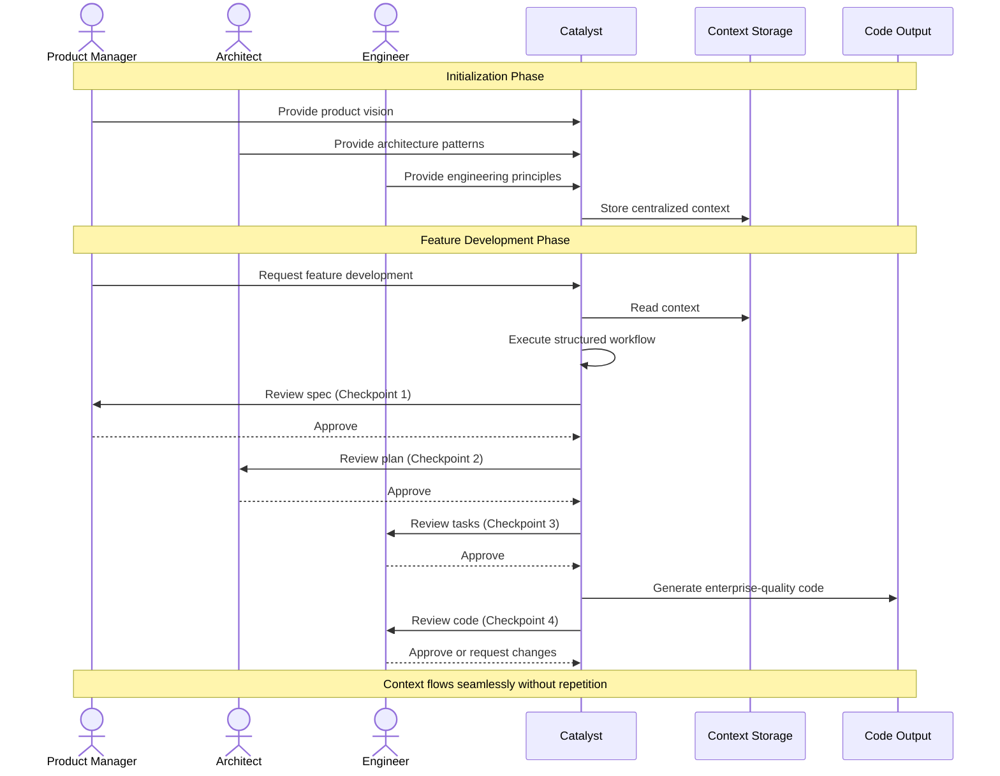

<!-- markdownlint-disable single-title -->

# Feature: Catalyst Product Blueprint

## Problem

AI code generation without context leads to poorly designed software that isn't reliable, doesn't scale, and has security vulnerabilities. Development teams need a framework that combines AI automation with context engineering and spec-driven development to maintain enterprise-scale quality while achieving autonomous execution.

## Goals

- Enable autonomous AI software development with human oversight at key milestones
- Provide context engineering foundation to maintain consistency across the software development lifecycle
- Support spec-driven development for consistent, reproducible workflows
- Enable progressive feature implementation through structured planning and execution
- Support multiple AI platforms with extensibility for future tools
- Achieve enterprise-scale quality for projects serving millions of monthly active users
- Make the framework easily accessible and deployable for developers

Explicit non-goals:

- Full automation without any human oversight - human review at key milestones is fundamental
- Real-time automated monitoring and response systems - focus is on structured development workflows

## Scenario

- As a **Product Manager**, I need AI to generate comprehensive feature specs while maintaining context about product vision and strategy
  - Outcome: Context-aware specs that align with product vision and strategy without manual copy-paste

- As an **Architect**, I need AI to follow established architecture patterns and design principles when implementing features
  - Outcome: Consistent technical decisions based on the defined architecture and engineering guidelines without repeated explanations

- As an **Engineer**, I need AI to implement features autonomously between checkpoints while adhering to quality standards
  - Outcome: 80% autonomous execution with human review only at spec, plan, task, and code milestones

## Success Criteria

- Successfully package and distribute the framework for easy integration into developer workflows
- Enable integration with multiple AI platforms

## Design principles

See [.xe/product.md](.xe/product.md) for product-wide design principles.

## Requirements

### Functional Requirements

- **FR:context**: Context Engineering
  - **FR:context.quality**: Framework MUST provide sufficient context to build enterprise-quality and scale software in a repeatable manner
  - **FR:context.setup**: Framework MUST enable quick setup in as few manual steps as possible

- **FR:workflows**: Spec-Driven Development
  - **FR:workflows.execution**: Framework MUST provide a platform-agnostic system for executing structured workflows that produce enterprise-quality and scale code
  - **FR:workflows.checkpoints**: Framework MUST support human checkpoints at key milestones to ensure autonomous AI execution is aligned with intended outcomes

- **FR:features**: Feature Implementation
  - **FR:features.planning**: Framework MUST provide a way for product managers to establish early, mass context on the collection of modular features that comprise the product
  - **FR:features.progressive**: Framework MUST enable progressive feature implementation through structured workflows
  - **FR:features.tracking**: Framework MUST enable tracking of feature completion status
  - **FR:features.dependencies**: Features MUST be implemented in dependency order based on their relationships

- **FR:extensibility**: Framework MUST be extensible to support multiple AI platforms

- **FR:distribution**: Framework MUST be easily accessible and deployable for developers to incorporate into their projects

### Non-functional requirements

- **NFR:cost**: Cost & usage efficiency
  - Framework SHOULD minimize AI token usage through efficient context management
  - Framework SHOULD leverage scripts to process and summarize data before providing to AI
  - Context SHOULD NOT be repeated in files that are used in the same workflows

- **NFR:reliability**: Reliability
  - Framework MUST handle errors gracefully with clear user guidance
  - Feature dependencies MUST be acyclic to prevent circular dependencies
  - Workflows MUST perform tasks consistently - executing the same workflow multiple times should produce the same outcome

- **NFR:performance**: Performance
  - Workflows MUST complete within reasonable timeframes

- **NFR:observability**: Observability
  - Framework MUST provide clear visibility into execution progress and status
  - Framework MUST provide clear error messages for failures

- **NFR:auditability**: Auditability
  - Framework MUST enable auditing of decisions and actions taken during feature development
  - Framework MUST trace how design principles guided implementation choices

## Key Entities

**Core domain entities:**

1. **Context** - Project knowledge including product vision, architecture patterns, engineering principles, and development processes

2. **Playbooks** - Repeatable processes for executing tasks and workflows with defined inputs, outputs, and steps

3. **Templates** - Reusable patterns for generating consistent documentation and specifications

4. **Features** - Discrete, modular capabilities that can be developed and released independently

5. **Blueprint** - High-level plans that organize features into phases with dependencies and priorities

**Inputs:**

- User-provided context for product and engineering requirements

**Outputs:**

- High-quality, enterprise-scale code

## Dependencies

- Version control system for managing code and collaboration
- Package management system for framework distribution
- Runtime environment for executing workflows

## System Architecture

