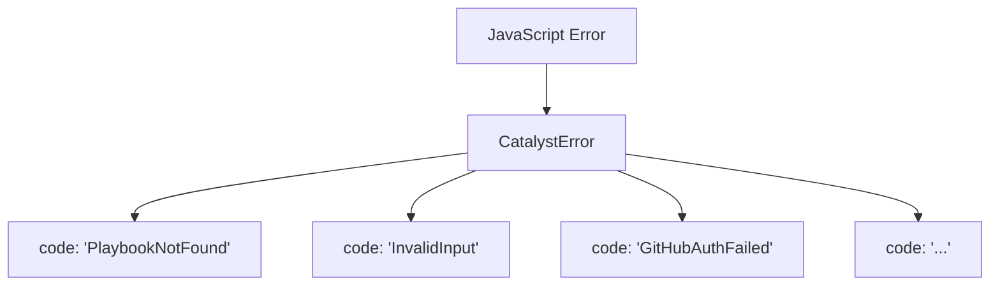

<!-- markdownlint-disable single-title -->

# Implementation Plan: Error Handling

**Spec**: [Feature spec](./spec.md)

---

## Summary

Implement single `CatalystError` class with explicit, descriptive error codes for consistent error handling across all Catalyst features. Each error includes PascalCased code, message, actionable guidance, and optional cause chaining. Single class scales to all scenarios without subclass complexity.

**Design rationale**: Single error class with explicit codes is simpler and more maintainable than multiple subclasses. Codes are human-readable strings (e.g., "PlaybookNotFound", "InvalidInput") that enable error policy matching.

---

## Technical Context

**Primary Components**: Single CatalystError class

**Data Structures**: CatalystError extending JavaScript Error with explicit code, guidance, and cause

**Dependencies**: None (foundational feature)

**Configuration**: None

**Performance Goals**: <1ms error instantiation, <5ms serialization

**Testing Framework**: Jest with 100% coverage target

**Key Constraints**: <30 lines total, no external dependencies, no subclasses

---

## Architecture Diagrams



---

## Project Structure

```
src/ts/errors/
  base.ts           # CatalystError class
  types.ts          # ErrorPolicy type
  index.ts          # Exports
tests/errors/
  base.test.ts      # CatalystError tests
```

---

## Data Model

**Entities owned by this feature:**

- **CatalystError**: Single error class for all scenarios
  - `message`: string - User-facing problem description
  - `code`: string - PascalCased error code (e.g., "PlaybookNotFound")
  - `guidance`: string - Actionable fix guidance
  - `cause`: Error | undefined - Optional underlying error

- **ErrorPolicy**: Type for error handling policies
  - Type: `string | Record<string, string>`
  - Values: PascalCased actions like "Fail", "Continue", "Retry:3"

**Entities from other features:**

- None

---

## Contracts

### CatalystError

**Signature:**

```typescript
class CatalystError extends Error {
  code: string;
  guidance: string;
  cause?: Error;

  constructor(message: string, code: string, guidance: string, cause?: Error);
  toJSON(): object;
}
```

**Purpose:** Single error class for all Catalyst errors with explicit codes

**Parameters:**

- `message` (string): User-facing problem description
- `code` (string): PascalCased error code (e.g., 'PlaybookNotFound', 'InvalidInput')
- `guidance` (string): Actionable fix guidance for user
- `cause` (Error, optional): Underlying error for chaining

**Returns:** CatalystError instance with all fields populated

**Errors/Exceptions:** None (constructor does not throw)

**Examples:**

```typescript
// Validation error
throw new CatalystError(
  'Missing required field: email',
  'InvalidInput',
  'Provide email address in format: user@example.com'
);

// Not found error
throw new CatalystError(
  `Playbook ${id} not found`,
  'PlaybookNotFound',
  'Check playbook ID and ensure file exists in src/playbooks/'
);

// With cause chaining
try {
  await callGitHub();
} catch (err) {
  throw new CatalystError(
    'GitHub authentication failed',
    'GitHubAuthFailed',
    'Run: gh auth login',
    err
  );
}
```

---

## Implementation Approach

### 1. CatalystError Implementation

Create `CatalystError` class in `src/ts/errors/base.ts`:

1. Extend JavaScript `Error` class
2. Add `code`, `guidance`, `cause` properties
3. Preserve stack trace with `Error.captureStackTrace()`
4. Implement `toJSON()` for serialization
5. Set `name` to "CatalystError"
6. <30 lines total

### 2. ErrorPolicy Type

Create `src/ts/errors/types.ts`:

```typescript
export type ErrorPolicy = string | Record<string, string>;
```

### 3. Export Organization

Create `src/ts/errors/index.ts`:

```typescript
export { CatalystError } from './base';
export type { ErrorPolicy } from './types';
```

### 4. Error Serialization

Implement `toJSON()` method on `CatalystError`:

```typescript
toJSON() {
  return {
    message: this.message,
    code: this.code,
    guidance: this.guidance,
    cause: this.cause,
    stack: this.stack
  };
}
```

### 5. Testing Strategy

**Unit tests** for CatalystError:
- Constructor sets all fields correctly
- `instanceof` checks work
- `toJSON()` produces correct output
- Error cause chaining works
- Stack traces preserved
- Code is PascalCased

**Coverage target**: 100%

---

## Usage Examples

**Basic usage:**

```typescript
import { CatalystError } from './errors';

// Validation error
if (!email) {
  throw new CatalystError(
    'Email is required',
    'InvalidInput',
    'Provide email in format: user@example.com'
  );
}

// Not found error
if (!user) {
  throw new CatalystError(
    `User ${userId} not found`,
    'UserNotFound',
    'Check user ID and try again'
  );
}
```

**Integration pattern (feature consumption):**

```typescript
// GitHub integration using error-handling
import { CatalystError } from '../errors';

async function createIssue(title: string) {
  try {
    const result = await exec(`gh issue create --title "${title}"`);
    return result;
  } catch (err) {
    // Detect error type and throw with explicit code
    if (err.message.includes('not logged in')) {
      throw new CatalystError(
        'GitHub CLI not authenticated',
        'GitHubAuthFailed',
        'Run: gh auth login',
        err
      );
    }
    if (err.message.includes('network')) {
      throw new CatalystError(
        'Failed to connect to GitHub',
        'NetworkError',
        'Check internet connection and retry',
        err
      );
    }
    throw new CatalystError(
      'Failed to create issue',
      'GitHubUnknownError',
      'Check error details and retry',
      err
    );
  }
}
```
