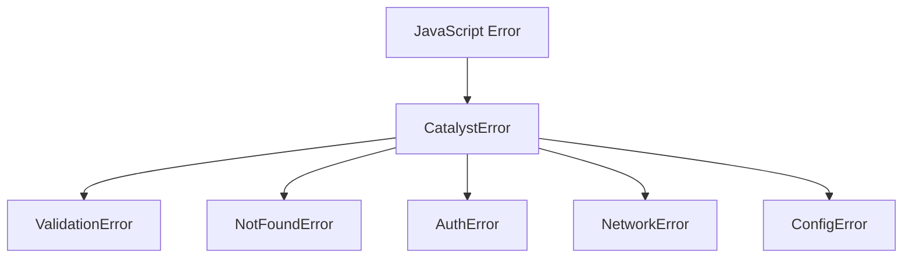

<!-- markdownlint-disable single-title -->

# Implementation Plan: Error Handling

**Spec**: [Feature spec](./spec.md)

---

## Summary

Implement base `CatalystError` class and 5 common error types (ValidationError, NotFoundError, AuthError, NetworkError, ConfigError) to provide consistent error handling across all Catalyst features. Each error includes error code, message, actionable guidance, and optional cause chaining. All code in `src/ts/errors/` with <50 lines per file.

**Design rationale**: See research in github-integration feature - error handling patterns extracted into shared foundation.

---

## Technical Context

**Primary Components**: CatalystError base class, 5 error type classes

**Data Structures**: Error classes extending JavaScript Error with additional fields (code, guidance, cause)

**Dependencies**: None (foundational feature)

**Configuration**: None

**Performance Goals**: <1ms error instantiation, <5ms serialization

**Testing Framework**: Jest with 100% coverage target

**Key Constraints**: <50 lines per file, no external dependencies

---

## Architecture Diagrams



---

## Project Structure

```
src/ts/errors/
  base.ts           # CatalystError base class
  validation.ts     # ValidationError
  not-found.ts      # NotFoundError
  auth.ts           # AuthError
  network.ts        # NetworkError
  config.ts         # ConfigError
  index.ts          # Exports all error classes
tests/ts/errors/
  base.test.ts      # CatalystError tests
  validation.test.ts
  not-found.test.ts
  auth.test.ts
  network.test.ts
  config.test.ts
```

---

## Data Model

**Entities owned by this feature:**

- **CatalystError**: Base error class
  - `message`: string - User-facing problem description
  - `code`: string - Machine-readable error code
  - `guidance`: string - Actionable fix guidance
  - `cause`: Error | null - Optional underlying error

**Entities from other features:**

- None

---

## Contracts

### CatalystError

**Signature:**

```typescript
class CatalystError extends Error {
  code: string;
  guidance: string;
  cause: Error | null;

  constructor(message: string, code: string, guidance: string, cause?: Error);
  toJSON(): object;
}
```

**Purpose:** Base error class with code and guidance for all Catalyst errors

**Parameters:**

- `message` (string): User-facing problem description
- `code` (string): Machine-readable error code (e.g., 'VALIDATION_ERROR')
- `guidance` (string): Actionable fix guidance for user
- `cause` (Error, optional): Underlying error for chaining

**Returns:** CatalystError instance with all fields populated

**Errors/Exceptions:** None (constructor does not throw)

**Examples:**

```typescript
// Basic usage
throw new CatalystError(
  'Invalid input provided',
  'VALIDATION_ERROR',
  'Check input format and try again'
);

// With cause chaining
try {
  await doSomething();
} catch (err) {
  throw new CatalystError(
    'Operation failed',
    'OPERATION_ERROR',
    'Retry or contact support',
    err
  );
}
```

### ValidationError

**Signature:**

```typescript
class ValidationError extends CatalystError {
  constructor(message: string, guidance: string, cause?: Error);
}
```

**Purpose:** Input validation failure error

**Parameters:**

- `message` (string): Validation failure description
- `guidance` (string): How to fix validation issue
- `cause` (Error, optional): Underlying error

**Returns:** ValidationError with code='VALIDATION_ERROR'

**Examples:**

```typescript
throw new ValidationError(
  'Missing required field: email',
  'Provide email address in format: user@example.com'
);
```

---

## Implementation Approach

### 1. Base Class Implementation

Create `CatalystError` base class in `src/ts/errors/base.ts`:

1. Extend JavaScript `Error` class
2. Add `code`, `guidance`, `cause` properties
3. Preserve stack trace with `Error.captureStackTrace()`
4. Implement `toJSON()` for serialization
5. Set `name` property for type identification

### 2. Error Type Classes

For each error type (ValidationError, NotFoundError, AuthError, NetworkError, ConfigError):

1. Extend `CatalystError`
2. Set fixed error code (e.g., 'VALIDATION_ERROR')
3. Constructor takes only message, guidance, optional cause
4. <50 lines per file

### 3. Export Organization

Create `src/ts/errors/index.ts` to export all classes:

```typescript
export { CatalystError } from './base';
export { ValidationError } from './validation';
export { NotFoundError } from './not-found';
export { AuthError } from './auth';
export { NetworkError } from './network';
export { ConfigError } from './config';
```

### 4. Error Serialization

Implement `toJSON()` method on `CatalystError`:

```typescript
toJSON() {
  return {
    name: this.name,
    message: this.message,
    code: this.code,
    guidance: this.guidance,
    cause: this.cause ? this.cause.message : null,
    stack: this.stack
  };
}
```

### 5. Testing Strategy

**Unit tests** for each error class:
- Constructor sets all fields correctly
- `instanceof` checks work
- `toJSON()` produces correct output
- Error cause chaining works
- Stack traces preserved

**Coverage target**: 100% (6 simple classes)

---

## Usage Examples

**Basic usage:**

```typescript
import { ValidationError, NotFoundError } from './errors';

// Throw validation error
if (!email) {
  throw new ValidationError(
    'Email is required',
    'Provide email in format: user@example.com'
  );
}

// Throw not found error
if (!user) {
  throw new NotFoundError(
    `User ${userId} not found`,
    'Check user ID and try again'
  );
}
```

**Integration pattern (feature consumption):**

```typescript
// GitHub integration using error-handling
import { CatalystError, AuthError, NetworkError } from '../errors';

async function createIssue(title: string) {
  try {
    // gh CLI call
    const result = await exec(`gh issue create --title "${title}"`);
    return result;
  } catch (err) {
    // Detect error type and throw appropriate error
    if (err.message.includes('not logged in')) {
      throw new AuthError(
        'GitHub CLI not authenticated',
        'Run: gh auth login',
        err
      );
    }
    if (err.message.includes('network')) {
      throw new NetworkError(
        'Failed to connect to GitHub',
        'Check internet connection and retry',
        err
      );
    }
    throw new CatalystError(
      'Failed to create issue',
      'GITHUB_ERROR',
      'Check error details and retry',
      err
    );
  }
}
```
