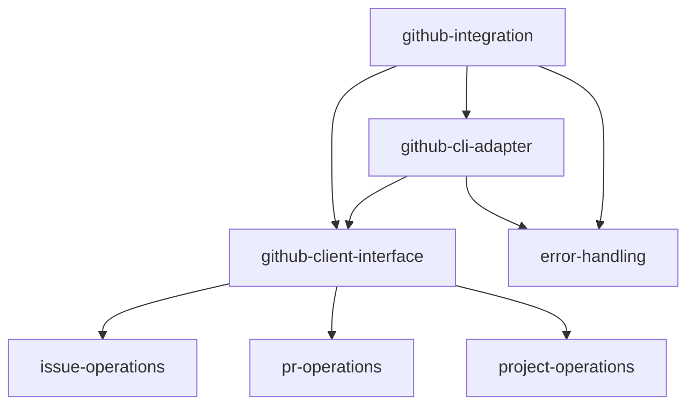

# Research: GitHub Integration

**Date**: 2025-11-12

## Current State Analysis

### Existing Implementation

The codebase already contains a comprehensive GitHub CLI wrapper at [src/playbooks/scripts/github.ts](../../../src/playbooks/scripts/github.ts) with the following capabilities:

**Project Operations:**
- `getProjectName()`: Extract repository name from git remote
- `isGitHubCliAvailable()`: Check for GitHub CLI installation

**Issue Operations:**
- `findIssue(titlePattern, projectName)`: Find issues by title pattern
- `getIssueBody(issueNumber)`: Fetch issue body
- `getIssueWithComments(issueNumber)`: Fetch issue with all comments
- `prepareIssueTemplate(templateName, projectName, replacements)`: Load and prepare issue templates
- `createGitHubIssue(title, body)`: Create new issues

**Pull Request Operations:**
- `findOpenPRs(searchPattern)`: Find PRs matching search pattern
- `getPRView(prNumber)`: Get PR title and body
- `getPRFeature(prNumber)`: Extract feature ID from PR branch/body and check for related files
- `findPRThreadsNeedingReplies(prNumber, aiPlatform)`: Find unresolved PR comment threads
- `getThreadComments(prNumber, threadId)`: Get all comments in a thread
- `postPRCommentReply(prNumber, commentId, body)`: Post threaded PR comment reply

**CLI Interface:**
The script provides a comprehensive CLI interface for all operations when executed directly with various `--` flags.

### Technical Architecture

**Current Implementation Patterns:**
- Direct use of `child_process.execSync` to invoke `gh` CLI commands
- JSON parsing of structured GitHub API responses
- Error handling with try-catch blocks and console logging
- Functions are synchronous (using execSync rather than async)

**Dependency Inversion Compliance:**
- The current implementation does NOT follow the Dependency Inversion principle
- Direct dependency on `execSync` and `gh` CLI (concrete implementation)
- No abstraction layer or interface for external dependencies
- Tightly coupled to GitHub CLI as the only integration method

### Gap Analysis

**What Exists:**
- Comprehensive GitHub CLI wrapper with issue and PR operations
- Good CLI interface for script invocation
- Solid error handling for basic cases

**What's Missing (Per Blueprint Scope):**
1. **Dependency Inversion Principle Implementation:**
   - No abstraction layer separating business logic from GitHub CLI
   - No interface defining GitHub operations contract
   - Direct coupling to `execSync` and `gh` CLI
   - Cannot easily swap implementations or mock for testing

2. **Consistent Error Handling:**
   - Error handling is basic (try-catch with console.log/warn/error)
   - No structured error types or error codes
   - No consistent error response format
   - Limited retry logic or resilience patterns

3. **Testing Infrastructure:**
   - No unit tests found for GitHub integration functions
   - No integration tests for CLI wrapper
   - No mocks or test fixtures
   - Cannot verify behavior without live GitHub CLI

4. **Type Safety:**
   - Some interfaces defined (PRComment, ThreadInfo, FeatureInfo)
   - Return types could be more explicit
   - Error handling types not well-defined

## Proposed Design Approach

### Architecture Pattern: Adapter with Dependency Inversion

**Goal:** Decouple business logic from GitHub CLI implementation while maintaining existing functionality.

**Approach:**
1. **Define GitHubClient Interface:**
   - Abstract contract for all GitHub operations
   - Return structured result types (not raw JSON strings)
   - Explicit error types for different failure modes

2. **Implement GitHubCliAdapter:**
   - Concrete implementation using existing `gh` CLI code
   - Implements GitHubClient interface
   - Encapsulates all `execSync` calls
   - Handles CLI-specific error parsing

3. **Refactor Existing Functions:**
   - Move business logic to use GitHubClient interface
   - Remove direct execSync dependencies from business functions
   - Keep backward compatibility with existing CLI interface

4. **Add Error Handling Strategy:**
   - Define error types: `GitHubCliError`, `GitHubApiError`, `GitHubAuthError`, `GitHubNotFoundError`
   - Implement consistent error handling across all operations
   - Add retry logic for transient failures
   - Provide clear, actionable error messages

### Sub-feature Dependency Tree

**Primary Feature:** `github-integration` (this feature)

**Sub-features:**
1. **github-client-interface** (Small) - Abstract interface defining GitHub operations contract
2. **github-cli-adapter** (Medium) - Concrete implementation using `gh` CLI
3. **error-handling** (Small) - Structured error types and consistent error handling
4. **issue-operations** (Small) - Business logic for issue operations (already exists, needs refactoring)
5. **pr-operations** (Medium) - Business logic for PR operations (already exists, needs refactoring)
6. **project-operations** (Small) - Business logic for project operations (already exists, needs refactoring)

### Implementation Strategy

**Phase 1: Extract and Define (No Breaking Changes)**
- Create GitHubClient interface
- Define error types and result types
- Extract business logic to separate layer
- Keep existing functions as facade to new implementation

**Phase 2: Implement Adapter (No Breaking Changes)**
- Implement GitHubCliAdapter using existing code
- Add comprehensive error handling
- Maintain 100% backward compatibility

**Phase 3: Add Testing (No Breaking Changes)**
- Create mock GitHubClient for testing
- Add unit tests for business logic layer
- Add integration tests with real CLI (optional)

**Phase 4: Enhance (Future)**
- Add retry logic and resilience patterns
- Consider additional adapters (REST API, GraphQL)
- Performance optimizations

## Technical Debt & Cleanup Opportunities

### Current Code Issues

1. **Synchronous Execution:**
   - All operations use `execSync` (blocking)
   - No async/await support
   - May cause performance issues for long-running operations
   - **Recommendation:** Keep synchronous for now (matches current playbook patterns), consider async in future phase

2. **Error Handling Inconsistency:**
   - Some functions return `null`, others log to console
   - Error information is lost (catch blocks don't propagate details)
   - No way to distinguish error types programmatically
   - **Recommendation:** Address in this rollout (required per blueprint scope)

3. **Hard-coded Repository:**
   - `findPRThreadsNeedingReplies` has hard-coded "Xerilium/catalyst"
   - **Recommendation:** Fix in this rollout (line 128 in github.ts)

4. **CLI Output Pollution:**
   - Functions mix data output (stdout) with logging (console.log/error)
   - Makes testing difficult
   - **Recommendation:** Separate concerns in this rollout

### Cleanup Scope

**Include in this rollout:**
- Fix hard-coded repository reference
- Implement consistent error handling per DIP
- Separate logging from data return
- Add comprehensive unit tests

**Defer to future:**
- Async/await migration (requires broader playbook changes)
- Additional adapter implementations (REST, GraphQL)
- Performance optimizations

## Risk Assessment

**Low Risk:**
- Existing code is well-structured and functional
- Refactoring can maintain 100% backward compatibility
- Changes are additive (new interface layer)

**Medium Risk:**
- Error handling changes may affect calling code expectations
- Need to ensure CLI interface remains stable
- Test coverage gap means we need careful validation

**Mitigation:**
- Comprehensive unit tests before refactoring
- Keep existing function signatures unchanged
- Add integration tests for CLI interface
- Document breaking changes (if any) clearly

## Dependencies

**Prerequisite Features:**
- None (first feature in Tier 1.3)

**Dependent Features:**
- `project-initialization` (Large) - Uses GitHub integration for issue fetching
- `slash-command-integration` (Medium) - May use GitHub integration
- Other features that need GitHub operations

## References

- Blueprint feature definition: [.xe/features/blueprint/plan.md:210-212](../../blueprint/plan.md)
- Existing implementation: [src/playbooks/scripts/github.ts](../../../src/playbooks/scripts/github.ts)
- Engineering principles: [.xe/engineering.md](../../engineering.md)
- Architecture patterns: [.xe/architecture.md](../../architecture.md)
