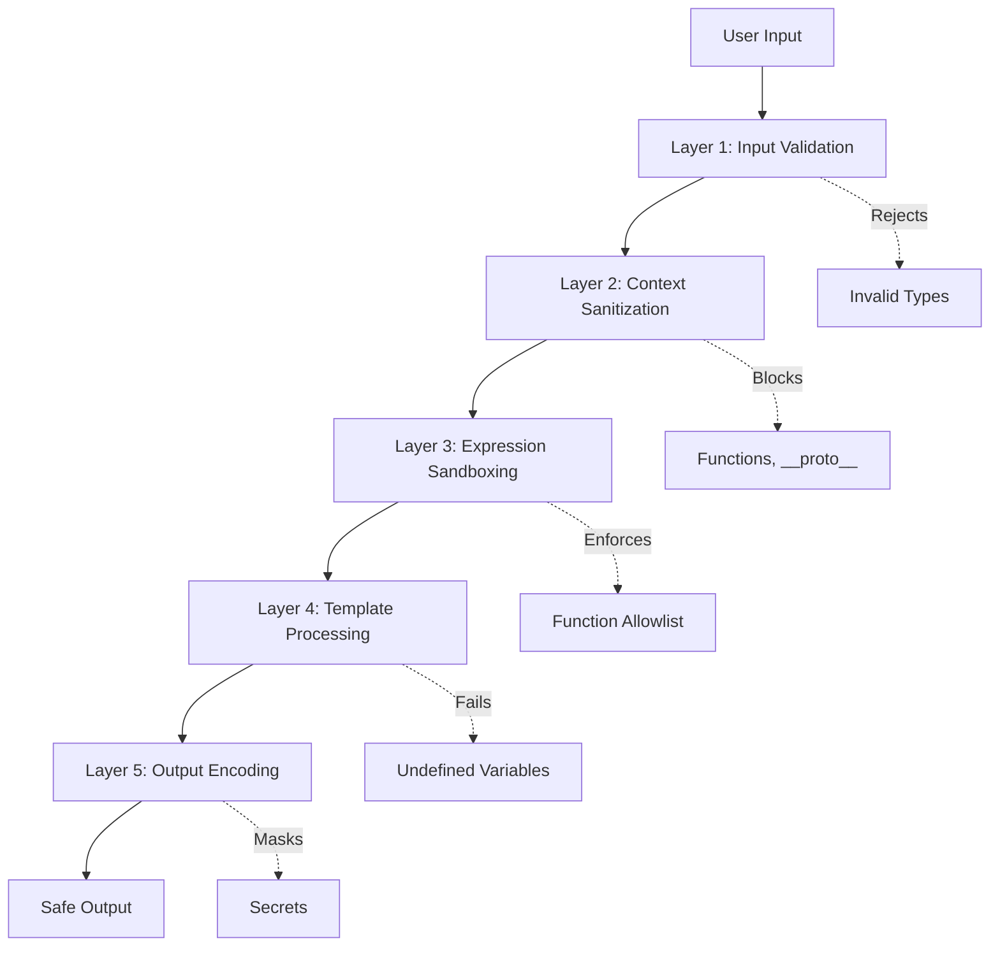

<!-- markdownlint-disable single-title -->

# Implementation Plan: Playbook Template Engine

> [CRITICAL INSTRUCTION]
> This implementation plan describes the full implementation of the feature **from scratch**, as if no code exists. Do NOT write this as a change to existing code or include migration guidance.

**Spec**: [Feature spec](./spec.md)

---

## Summary

The Playbook Template Engine provides secure template interpolation and expression evaluation for Catalyst workflows. It implements dual syntax (`{{variable}}` for simple string substitution via custom regex-based interpolation and `${{ expression }}` for JavaScript expression evaluation via expr-eval-fork v3.0.0+) with multi-layer security to prevent code injection. The engine provides custom path protocol resolution (`xe://`, `catalyst://`) for clean file references and auto-loads JavaScript modules alongside playbooks for custom function definitions. This enables playbook authors to reference runtime variables, make conditional decisions, load templates from standard locations, and define custom functions while maintaining security guarantees that prevent RCE, prototype pollution, and secret leakage.

---

## Technical Context

This feature implementation plan extends the technical architecture defined in `.xe/architecture.md`.

**Feature-specific technical details:**

- **Primary Components**:
  - `TemplateEngine` - Main class for template interpolation and expression evaluation
  - `PathProtocolResolver` - Resolves `xe://` and `catalyst://` path protocols to file system paths
  - `SecretManager` - Registers and masks secrets in all outputs
  - `ModuleLoader` - Auto-loads JavaScript modules alongside playbooks

- **Data Structures**:
  - `ExecutionContext` - Map of variable names to values (from playbook-definition)
  - Template strings with `{{variable}}` and `${{ expression }}` markers
  - JavaScript module exports as `Record<string, Function>`

- **Dependencies**:
  - `expr-eval-fork@^3.0.0` - Expression evaluator (CVE-2025-12735 patched)
  - `error-handling` (Tier 1.1) - CatalystError base class
  - No template engine needed - custom regex-based interpolation for `{{variable}}`

- **Configuration**:
  - No external configuration files
  - Defaults: 10s timeout for expressions
  - Strict mode: fail on undefined variables

- **Performance Goals**:
  - Simple expression evaluation: <2ms per expression
  - Path protocol resolution: <1ms per path
  - Module loading: <100ms per module
  - Template interpolation overhead: <1% of total playbook execution time

- **Testing Framework**:
  - Jest for unit testing
  - 100% coverage target for security-critical code (context sanitization, secret masking)
  - Security test suite for injection attempts

- **Key Constraints**:
  - No access to Node.js APIs from templates/expressions (fs, process, require, child_process)
  - Function objects rejected in context (RCE mitigation for CVE-2025-12735)
  - Secrets must never appear in plaintext in logs or state files
  - Expression timeout: 10 seconds maximum
  - Script memory limit: 50 MB maximum

**Testing approach from architecture.md:**
- TypeScript strict mode enabled
- Test framework: Jest with ts-jest
- Coverage target: 80% overall, 100% for security-critical code

---

## Architecture Diagrams

### Template Processing Flow

```mermaid
graph TB
    A[Playbook Step Config] --> B[TemplateEngine.interpolate]
    B --> C{Scan for ${{'{{'}}}}
    C -->|Found| D[Process Inline Scripts]
    C -->|Not Found| E[Process Variables]
    D --> F[expr-eval-fork evaluate]
    F --> G[Replace with result]
    G --> E
    E --> H[LiquidJS parseAndRender]
    H --> I[Resolve Path Protocols]
    I --> J[Mask Secrets]
    J --> K[Return Interpolated Config]
```

### Security Layers



---

## Project Structure

```
src/
  playbooks/
    scripts/
      playbooks/
        template/              # Template engine implementation
          engine.ts            # Main TemplateEngine class
          path-resolver.ts     # PathProtocolResolver
          secret-manager.ts    # SecretManager
          module-loader.ts     # ModuleLoader
          sanitizer.ts         # Context sanitization
tests/
  unit/
    playbooks/
      template/
        engine.test.ts         # Core interpolation tests
        security.test.ts       # Security test suite
        path-resolver.test.ts  # Path protocol tests
```

---

## Data Model

**Entities owned by this feature:**

- **TemplateEngine**: Core service for template interpolation and expression evaluation
  - Uses custom regex for `{{variable}}` interpolation (no external dependency)
  - `exprParser`: Parser (expr-eval-fork instance for `${{ expression }}` syntax)
  - `secretManager`: SecretManager (secret masking service)
  - `pathResolver`: PathProtocolResolver (resolves xe:// and catalyst:// protocols)
  - Methods: `interpolate()`, `interpolateObject()`, `loadModule()`, `registerSecret()`

- **PathProtocolResolver**: Resolves custom path protocols to file system paths
  - `repoRoot`: string (repository root directory path)
  - `catalystRoot`: string (node_modules/@xerilium/catalyst path)
  - Methods: `resolve()` - Returns absolute file path with auto-detected extension

- **SecretManager**: Manages secret registration and masking
  - `secrets`: Map<string, string> (secret name to value mapping)
  - Methods: `register()`, `mask()`, `resolve()`

- **ModuleLoader**: Loads JavaScript modules alongside playbooks
  - Methods: `loadModule()` - Returns module exports as Record<string, Function>

**Entities from other features:**

- **ExecutionContext** (playbook-definition): Runtime context with variables (Record<string, unknown>)
- **CatalystError** (error-handling): Base error class for template errors
- **PlaybookAction** (playbook-definition): Actions receive interpolated config from template engine

---

## Contracts

### TemplateEngine.interpolate()

**Signature:**

```typescript
async interpolate(template: string, context: ExecutionContext): Promise<string>
```

**Purpose:** Interpolate template string with execution context, processing both `{{variable}}` and `${{ expression }}` syntax.

**Parameters:**

- `template` (string): Template string containing `{{}}` or `${{}}` expressions
- `context` (ExecutionContext): Execution context variables (Record<string, unknown>)

**Returns:** Promise<string> - Fully resolved string with all templates interpolated

**Errors/Exceptions:**

- Throws `CatalystError` with code 'InvalidStringTemplate' when `{{variable}}` syntax is malformed or variable not found
- Throws `CatalystError` with code 'InvalidExpressionTemplate' when `${{ expression }}` has syntax errors or evaluation fails
- Throws `CatalystError` with code 'ExpressionTimeout' when expression evaluation exceeds 10 second timeout

**Examples:**

```typescript
// Basic variable substitution
const result = await engine.interpolate(
  'Hello {{name}}!',
  { name: 'World' }
);
// Returns: "Hello World!"

// Expression evaluation
const result = await engine.interpolate(
  'Result: ${{ get("x") + get("y") }}',
  { x: 5, y: 3 }
);
// Returns: "Result: 8"

// Path protocol resolution
const result = await engine.interpolate(
  'Read {{xe://product}}',
  {}
);
// Returns: "Read /Users/user/project/.xe/product.md"
```

### TemplateEngine.interpolateObject()

**Signature:**

```typescript
async interpolateObject<T>(obj: T, context: ExecutionContext): Promise<T>
```

**Purpose:** Recursively interpolate all string values in an object.

**Parameters:**

- `obj` (T): Object with template strings (generic type)
- `context` (ExecutionContext): Execution context variables

**Returns:** Promise<T> - Object with all string values interpolated

**Errors/Exceptions:** Same as `interpolate()`

**Examples:**

```typescript
// Interpolate step config
const config = {
  title: 'Issue: {{feature-name}}',
  priority: '${{ get("urgent") ? 10 : 5 }}',
  nested: {
    path: '{{xe://features/{{feature-name}}/spec}}'
  }
};

const result = await engine.interpolateObject(config, {
  'feature-name': 'auth',
  urgent: true
});
// Returns: {
//   title: 'Issue: auth',
//   priority: 10,
//   nested: { path: '/Users/user/project/.xe/features/auth/spec.md' }
// }
```

### TemplateEngine.loadModule()

**Signature:**

```typescript
async loadModule(playbookPath: string): Promise<Record<string, Function> | undefined>
```

**Purpose:** Load JavaScript module for playbook if it exists (e.g., `playbook.yaml` → `playbook.js`).

**Parameters:**

- `playbookPath` (string): Absolute path to playbook YAML file

**Returns:** Promise<Record<string, Function> | undefined> - Module exports or undefined if no module exists

**Errors/Exceptions:**

- Throws `CatalystError` with code 'ModuleLoadError' when module file exists but has syntax errors or fails to load

**Examples:**

```typescript
// Auto-load module alongside playbook
const functions = await engine.loadModule('/path/to/update-pr.yaml');
// Returns: { validatePR: Function, calculatePriority: Function, ... }

// No module exists
const functions = await engine.loadModule('/path/to/simple.yaml');
// Returns: undefined
```

### PathProtocolResolver.resolve()

**Signature:**

```typescript
resolve(protocolPath: string): string
```

**Purpose:** Resolve `xe://` or `catalyst://` path protocol to absolute file system path with auto-detected extension.

**Parameters:**

- `protocolPath` (string): Path with protocol prefix (e.g., `xe://product`, `catalyst://templates/spec`)

**Returns:** string - Absolute file path with extension (prefers .md, falls back to .json, then no extension)

**Errors/Exceptions:**

- Throws `CatalystError` with code 'InvalidProtocol' when protocol is not recognized

**Examples:**

```typescript
// xe:// protocol
const path = resolver.resolve('xe://product');
// Returns: '/Users/user/project/.xe/product.md' (if exists)

// catalyst:// protocol
const path = resolver.resolve('catalyst://templates/specs/spec');
// Returns: '/Users/user/project/node_modules/@xerilium/catalyst/templates/specs/spec.md'

// No extension provided, auto-detect
const path = resolver.resolve('xe://config');
// Returns: '/Users/user/project/.xe/config.json' (if config.json exists, no config.md)
```

### SecretManager.mask()

**Signature:**

```typescript
mask(text: string): string
```

**Purpose:** Replace all registered secrets in text with `[SECRET:name]` placeholders.

**Parameters:**

- `text` (string): Text potentially containing secrets

**Returns:** string - Text with secrets replaced

**Errors/Exceptions:** None

**Examples:**

```typescript
secretManager.register({ name: 'GITHUB_TOKEN', value: 'ghp_abc123' });

const masked = secretManager.mask('Token: ghp_abc123');
// Returns: "Token: [SECRET:GITHUB_TOKEN]"
```

---

## Implementation Approach

### 1. Data Structures

**Input Formats:**

```typescript
// Template strings
type TemplateString = string; // Contains {{variable}} or ${{ expression }}

// Execution context (from playbook-definition)
interface ExecutionContext {
  [key: string]: unknown; // Variable name → value
}

// Module exports
type ModuleExports = Record<string, Function>;

// Secret registration
interface Secret {
  name: string;
  value: string;
}
```

**Output Formats:**

```typescript
// Interpolated strings
type InterpolatedString = string; // All templates resolved

// Error codes (used with CatalystError)
type TemplateErrorCode =
  | 'InvalidStringTemplate'
  | 'InvalidExpressionTemplate'
  | 'ExpressionTimeout'
  | 'ModuleLoadError'
  | 'InvalidProtocol';
```

### 2. Core Algorithms

#### Template Interpolation Algorithm

1. **Scan for inline scripts** (`${{ expression }}`):
   - Use regex `/\$\{\{(.+?)\}\}/g` to find all `${{ }}` blocks
   - **CRITICAL**: `${{ }}` expressions must be valid JavaScript - do NOT allow `{{}}` inside `${{}}`
   - For each match:
     - Extract expression code (must be pure JavaScript)
     - Sanitize context (remove functions, __proto__, constructor, prototype)
     - Call `expr-eval-fork` parser.evaluate(code, safeContext)
     - Replace `${{ code }}` with result
     - On timeout (>10s), throw CatalystError with code 'ExpressionTimeout'
     - On syntax error, throw CatalystError with code 'InvalidExpressionTemplate'

2. **Process variable substitutions** (`{{variable}}`):
   - Use regex `/\{\{([^}]+)\}\}/g` to find all `{{ }}` blocks
   - For each match:
     - Extract variable name (supports dot notation: `issue.body`)
     - Split by '.' and traverse context object
     - Replace `{{variable}}` with value
     - On undefined variable, throw CatalystError with code 'InvalidStringTemplate'

3. **Resolve path protocols**:
   - Find all `xe://path` and `catalyst://path` patterns
   - For each match:
     - Call PathProtocolResolver.resolve(match)
     - Replace protocol path with absolute file path
     - Auto-detect extension (.md, .json, or none)

4. **Mask secrets**:
   - Call SecretManager.mask(result)
   - Replace all registered secret values with `[SECRET:name]`

5. **Return interpolated string**

#### Context Sanitization Algorithm

1. **Create safe context**: `Object.create(null)` (no prototype)
2. **Iterate context entries**:
   - If key is `__proto__`, `constructor`, or `prototype`, skip
   - If value is function type, throw error (RCE mitigation)
   - Otherwise, copy to safe context
3. **Return safe context** for expression evaluation

#### Path Protocol Resolution Algorithm

1. **Parse protocol**: Extract protocol and path from `protocol://path`
2. **Resolve base directory**:
   - `xe://` → `.xe/` directory in repository root
   - `catalyst://` → `node_modules/@xerilium/catalyst/` directory
3. **Auto-detect extension** (if not provided):
   - Try `path.md` first (default)
   - Try `path.json` second (fallback)
   - Use `path` as-is (no extension)
4. **Return absolute file path**

#### Module Loading Algorithm

1. **Construct module path**: Replace `.yaml` with `.js` in playbook path
2. **Check if module exists**: `fs.existsSync(modulePath)`
3. **If not exists**: Return undefined
4. **If exists**:
   - Dynamically import module: `await import(modulePath)`
   - Validate exports are functions only
   - Return exports as Record<string, Function>
   - On import error, throw ModuleLoadError

### 3. Dependencies

**Internal dependencies:**
- **error-handling** (Tier 1.1): CatalystError base class for template errors
- **playbook-definition** (Tier 1.2): ExecutionContext type definition

**External dependencies:**
- **expr-eval-fork v3.0.0+**: Expression evaluation for `${{ expression }}` syntax (CVE-2025-12735 patched)

### 4. Error Handling

**Validation Rules:**

1. **Input validation**:
   - Context must be object (not null, not primitive)
   - Template must be string
   - Function objects in context are rejected (throw error immediately)

2. **Expression syntax errors**:
   - Catch parse errors from expr-eval-fork
   - Throw CatalystError with code 'InvalidExpressionTemplate' and clear message
   - Include original expression in error message for debugging

3. **Undefined variable errors**:
   - On variable not found in context → throw CatalystError with code 'InvalidStringTemplate'
   - Include variable name in error message

4. **Timeout errors**:
   - Expression evaluation > 10s → throw CatalystError with code 'ExpressionTimeout'
   - Include expression in error message for debugging

5. **Module load errors**:
   - Module syntax errors → throw CatalystError with code 'ModuleLoadError'
   - Module not found → return undefined (not an error)

**Edge Cases:**

- Empty template → return as-is
- Empty context → only static text returns (variables fail if strict mode)
- Nested templates → process inside-out (inline scripts first, then variables)
- Circular references → prevented by single-pass evaluation
- Special characters in variables → Liquid handles escaping
- Path traversal attempts → blocked by PathProtocolResolver (must start with xe:// or catalyst://)

**Graceful Degradation:**

- If expression evaluation fails, do NOT fall back to unsafe eval()
- If module load fails, continue without custom functions (throw clear error if used)
- If secret masking fails, log warning but continue (better to expose than crash)

### 5. Performance Considerations

**Optimization Strategies:**

1. **Template caching** (Future):
   - Parse Liquid templates once, reuse compiled template
   - Cache key: template string hash
   - Invalidate on template change

2. **Regex compilation**:
   - Compile regex patterns once at initialization
   - Reuse compiled patterns for all interpolations

3. **Context reuse**:
   - Avoid re-sanitizing same context multiple times
   - Track sanitization status with WeakMap

4. **Lazy module loading**:
   - Only load modules when playbook is executed
   - Cache loaded modules by path

**Measurable Targets:**

- Simple expression (`${{ get('x') + get('y') }}`): <2ms
- Variable substitution (`{{variable}}`): <1ms per variable
- Path protocol resolution (`xe://path`): <1ms per path
- Module loading: <100ms per module
- Total interpolation overhead: <1% of playbook execution time

**Memory Management:**

- Clear expression parser cache after 1000 evaluations
- Limit cached templates to 100 entries (LRU eviction)
- Module exports stay in memory (shared across playbook runs)

### 6. Testing Strategy

**Unit Tests:**

1. **Template interpolation**:
   - Simple variable substitution (`{{variable}}`)
   - Nested properties with dot notation (`{{issue.body}}`)
   - Expression evaluation (`${{ get('x') + get('y') }}`)
   - Boolean expressions (`${{ get('approved') && get('count') > 5 }}`)
   - Both syntaxes in same template (separate, not nested)
   - Path protocol resolution
   - Secret masking

2. **Edge cases**:
   - Empty template
   - Empty context
   - Undefined variables
   - Malformed syntax
   - Circular references (prevented)

3. **Critical constraint validation**:
   - Verify `{{}}` syntax is REJECTED inside `${{}}` expressions
   - Ensure `${{}}` must contain valid JavaScript only

3. **Error scenarios**:
   - Syntax errors in expressions
   - Timeout errors
   - Module load failures
   - Invalid protocols

**Security Tests (100% coverage required):**

1. **Code injection attempts**:
   - Function objects in context (must reject)
   - `__proto__` pollution (must block)
   - `constructor` access (must block)
   - `eval()` calls in expressions (must fail)
   - `require()` calls (must fail)

2. **Secret leakage prevention**:
   - Secrets in templates (must mask)
   - Secrets in error messages (must mask)
   - Secrets in logs (must mask)

3. **Path traversal attempts**:
   - `xe://../../../etc/passwd` (must reject)
   - `catalyst://../../../etc/passwd` (must reject)

**Integration Tests:**

1. **End-to-end template processing**:
   - Receive playbook step config (JSON)
   - Interpolate step configs
   - Return interpolated config

2. **Module loading**:
   - Auto-load .js module alongside playbook file
   - Call custom functions from expressions
   - Handle missing modules gracefully

**Performance Tests:**

- Benchmark interpolation with 1000 variables
- Benchmark expression evaluation with 1000 calls
- Measure memory usage with large contexts (1MB)

**Coverage Targets:**

- Overall: 80% minimum
- Security-critical code: 100% (context sanitization, secret masking, input validation)

---

## Usage Examples

### Basic Usage: Variable Substitution

```typescript
import { TemplateEngine } from './runtime/template-engine';

const engine = new TemplateEngine();

// Simple variable substitution
const result = await engine.interpolate(
  'Feature: {{feature-name}}',
  { 'feature-name': 'authentication' }
);
console.log(result); // "Feature: authentication"

// Nested properties
const result2 = await engine.interpolate(
  'PR #{{pr.number}}: {{pr.title}}',
  {
    pr: {
      number: 123,
      title: 'Add authentication'
    }
  }
);
console.log(result2); // "PR #123: Add authentication"
```

### Advanced Usage: Expression Evaluation

```typescript
// Boolean expressions
const config = {
  createPR: '${{ get("mode") == "pull-request" }}',
  priority: '${{ get("urgent") ? 10 : 5 }}',
  branchName: 'feature/{{feature-name}}'
};

const context = {
  mode: 'pull-request',
  urgent: true,
  'feature-name': 'auth'
};

const result = await engine.interpolateObject(config, context);
console.log(result);
// {
//   createPR: true,
//   priority: 10,
//   branchName: 'feature/auth'
// }
```

### Integration Pattern: Usage by Playbook Engine

```typescript
// Example: How playbook-engine feature would use this
import { TemplateEngine } from '../scripts/playbooks/template/engine';

class PlaybookEngine {
  private templateEngine: TemplateEngine;

  constructor() {
    this.templateEngine = new TemplateEngine();
  }

  async executeStep(step: PlaybookStep, context: ExecutionContext) {
    // Load custom module functions (if any)
    const moduleFunctions = await this.templateEngine.loadModule(
      this.playbookPath
    );
    if (moduleFunctions) {
      // Register custom functions with expression evaluator
      for (const [name, fn] of Object.entries(moduleFunctions)) {
        this.templateEngine.registerFunction(name, fn);
      }
    }

    // Interpolate step config before action execution
    const interpolatedConfig = await this.templateEngine.interpolateObject(
      step.config,
      context
    );

    // Execute action with interpolated config
    const action = this.getAction(step.action);
    const result = await action.execute(interpolatedConfig);

    return result;
  }
}
```
