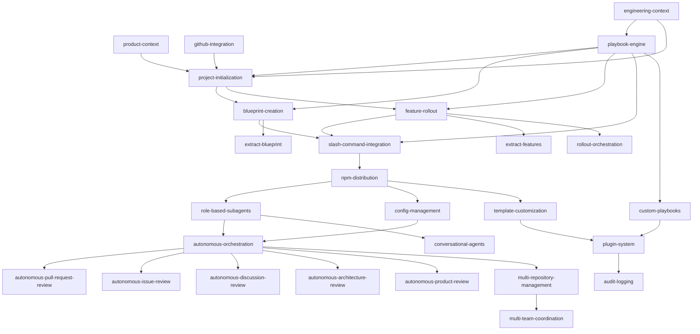

<!-- markdownlint-disable single-title -->

# Feature: Catalyst Product Blueprint

## Problem

Catalyst needs a structured product roadmap that breaks down the product vision into discrete, implementable features with clear dependencies, priorities, and phase assignments to enable systematic development from POC through enterprise-scale.

## Goals

- Define all features required to deliver Catalyst's vision across 5 phases (POC, Mainstream, Innovation, Platform, Enterprise)
- Establish clear feature dependencies to prevent implementation order errors
- Assign features to phases based on strategic priorities
- Provide complexity estimates to aid resource planning
- Enable parallel feature development within dependency tiers
- Create living roadmap that tracks feature implementation status

Explicit non-goals:

- Detailed implementation plans for individual features (handled per-feature via start-rollout playbook)
- Technology-specific decisions beyond architecture.md patterns
- Migration strategies from predecessor systems

## Scenario

- As a **Product Manager**, I need to see the complete product roadmap so that I can prioritize features and communicate vision to stakeholders
  - Outcome: Clear understanding of all features, their dependencies, and strategic phasing

- As an **Architect**, I need to understand feature dependencies so that I can sequence implementation work correctly
  - Outcome: No implementation order errors, ability to identify features that can be built in parallel

- As an **Engineer**, I need complexity estimates and clear scope boundaries so that I can plan work and avoid scope creep
  - Outcome: Accurate effort estimates, well-scoped features with single responsibilities

- As a **Framework User**, I need to understand which features are available in each phase so that I can adopt Catalyst at the right maturity level for my needs
  - Outcome: Clear phase assignments guide adoption timing

## Success Criteria

- All 27 features documented with unique IDs, names, descriptions, phase assignments, dependencies, complexity, and priority
- Feature dependency graph is acyclic (no circular dependencies)
- Features are organized into phase-relative tiers (1.1, 1.2, 2.1, etc.)
- Phase 1 features have detailed specifications; Phase 2-5 features have high-level descriptions
- Complexity distribution is balanced (not all Large features in one tier)
- Every feature has clear 1-2 sentence scope description
- Rollout plan tracks feature implementation status across all phases

## Design principles

- **Phase-driven prioritization**
  > Features are assigned to phases based on strategic priorities from product.md (POC → Mainstream → Innovation → Platform → Enterprise → Scale). Phase assignments drive implementation sequencing and help users understand feature maturity.

- **Dependency-first ordering**
  > Within each phase, features are ordered by dependencies first (can't build X without Y), then by business value and risk. This prevents implementation order errors and enables parallel work on features in the same tier.

- **Living specification**
  > The blueprint is a living document that tracks feature implementation status and can be updated as product strategy evolves. Phase transition checkpoints allow re-blueprinting before starting new phases.

- **Single responsibility per feature**
  > Each feature represents a discrete, independently implementable capability with clear scope boundaries (1-2 sentences). Features can be extracted, replaced, or enhanced without affecting other features.

## Requirements

### Functional Requirements

- **FR-1**: Blueprint spec MUST document all features identified for Catalyst across all 5 phases
- **FR-2**: Each feature MUST have a unique kebab-case ID (e.g., `product-context`, `autonomous-orchestration`)
- **FR-3**: Each feature MUST have a phase assignment matching product.md Product Strategy phases (POC, Mainstream, Innovation, Platform, Enterprise, Scale)
- **FR-4**: Each feature MUST have dependency tier using phase-relative numbering (e.g., 1.1, 1.2, 2.1) to prevent cascading renumbering when phases evolve
- **FR-5**: Each feature MUST list dependencies as array of feature IDs it depends on
- **FR-6**: Each feature MUST have 1-2 sentence scope description defining boundaries
- **FR-7**: Each feature MUST have complexity estimate (Small, Medium, Large) based on implementation effort
- **FR-8**: Each feature MUST have priority order number for implementation sequencing
- **FR-9**: Blueprint spec MUST include feature dependency graph in mermaid format
- **FR-10**: Feature dependency graph MUST be acyclic (no circular dependencies)
- **FR-11**: Features in same tier SHOULD be implementable in parallel (no cross-dependencies within tier)
- **FR-12**: Phase 1 features MUST have detailed scope descriptions; Phase 2-5 MAY have high-level descriptions with "TBD - detail during Phase X planning" notation
- **FR-13**: Rollout plan MUST track implementation status for all features with checkboxes
- **FR-14**: Blueprint MUST define core entities that features operate on (context files, templates, playbooks, rollouts)

### Non-functional requirements

- **NFR-1**: Cost & usage efficiency
  - Blueprint document MUST remain under 5000 tokens to avoid excessive AI context usage
  - Phase 2-5 feature descriptions SHOULD be concise (1-2 sentences) to defer detailed planning

- **NFR-2**: Security
  - Not applicable - blueprint is a specification document with no security surface

- **NFR-3**: Reliability
  - Dependency graph MUST be validated for cycles before merging
  - Feature IDs MUST be unique across all phases

- **NFR-4**: Performance
  - Blueprint spec MUST be parseable by AI in single pass without external dependencies

- **NFR-5**: Observability
  - Rollout plan tracks feature implementation status for visibility
  - Phase assignments enable filtering features by maturity level

- **NFR-6**: Accessibility
  - Blueprint MUST be human-readable markdown suitable for both AI and human review
  - Mermaid graph MUST render correctly in GitHub for visual dependency understanding

- **NFR-7**: Globalization
  - Not applicable - Catalyst is English-only framework

- **NFR-8**: Backward compatibility
  - Phase-relative tier numbering prevents breaking changes when phases evolve
  - Feature IDs SHOULD remain stable across blueprint updates

## Key Entities

Entities owned by this feature:

- **Blueprint Specification**: Complete feature roadmap in `.xe/specs/blueprint/spec.md` with all features, dependencies, phases, and priorities
- **Feature**: Discrete capability with ID, name, description, phase, tier, dependencies, complexity, and priority
- **Feature Dependency Graph**: Acyclic directed graph showing which features depend on others
- **Phase**: Strategic grouping of features (POC, Mainstream, Innovation, Platform, Enterprise)
- **Tier**: Dependency-based grouping within a phase (e.g., 1.1, 1.2, 1.3) where features in same tier can be built in parallel

Entities from other features:

- **Context Files** (product-context, engineering-context): Files that features read/write to understand project requirements
- **Playbooks** (playbook-engine): Structured workflows that features execute
- **Rollout Plans** (feature-rollout): Orchestration plans that coordinate feature implementation

Inputs:

- GitHub issue #41 content with phased implementation details
- `.xe/product.md` for product strategy and phase priorities
- `.xe/architecture.md` for technical patterns and constraints
- `.xe/engineering.md` for design principles (KISS, YAGNI, SRP, DRY, etc.)
- Existing source code structure for understanding current implementation state

Outputs:

- `.xe/specs/blueprint/spec.md` with complete feature breakdown
- `.xe/specs/blueprint/research.md` with analysis and decision log
- `.xe/specs/blueprint/plan.md` with feature breakdown methodology
- `.xe/specs/blueprint/tasks.md` with steps to populate spec
- `.xe/rollouts/rollout-blueprint.md` with feature status tracking
- Feature dependency graph in mermaid format

## Dependencies

- This is a meta-feature that defines all other features, so it has no dependencies
- However, it MUST read existing context files (product.md, architecture.md, engineering.md) to inform feature breakdown
- GitHub integration (gh CLI or API access) is required to fetch issue #41 content

## Core Entities

The blueprint defines the following core entities that Catalyst features operate on:

1. **Context Files** - Markdown files in `.xe/` directory containing project state
   - `product.md` - Product vision, strategy, team, success metrics
   - `architecture.md` - Technical patterns, technology stack, repository structure
   - `engineering.md` - Engineering principles and standards
   - `process/development.md` - Development workflow phases
   - `competitive-analysis.md` - Market research and competitive positioning

2. **Templates** - Reusable markdown templates for issues, specs, plans, tasks, rollouts
   - Located in `src/templates/` (framework) or `node_modules/@xerilium/catalyst/templates/` (project-specific overrides)
   - Support variable substitution via conventions defined in engineering standards

3. **Playbooks** - AI-agnostic workflow definitions with inputs, outputs, and execution steps
   - Located in `node_modules/@xerilium/catalyst/playbooks/`
   - Define structured workflows (start-initialization, start-blueprint, start-rollout)
   - Include error handling, checkpoints, and success criteria

4. **Features** - Discrete capabilities with specs, plans, and tasks
   - Located in `.xe/specs/{feature-id}/` directory
   - Each feature has: spec.md (requirements), plan.md (design), tasks.md (implementation), research.md (analysis)

5. **Rollouts** - Orchestration plans coordinating feature implementation
   - Located in `.xe/rollouts/rollout-{rollout-id}.md`
   - Coordinate: pre-implementation → tasks.md → post-implementation → cleanup
   - Track feature implementation status

## Feature Breakdown

### Phase 1: POC - Early Adopters (11 features)

**Tier 1.1: Context Foundation**
1. **product-context** (Small, Priority 1)
   - Dependencies: None
   - Scope: PM-owned context files (product.md, competitive-analysis.md) defining product vision, strategy, team, and success metrics

2. **engineering-context** (Medium, Priority 2)
   - Dependencies: None
   - Scope: Engineering-owned context files (architecture.md, engineering.md, process/development.md) defining technical patterns, principles, and workflows

3. **github-integration** (Medium, Priority 3)
   - Dependencies: None
   - Scope: GitHub CLI wrapper for issue and PR operations with consistent error handling per Dependency Inversion principle

**Tier 1.2: Core Workflows**
4. **playbook-engine** (Large, Priority 4)
   - Dependencies: engineering-context
   - Scope: Execute structured workflows with inputs, outputs, steps, checkpoints, and error handling; support for manual and autonomous execution modes

5. **project-initialization** (Large, Priority 5)
   - Dependencies: product-context, engineering-context, github-integration, playbook-engine
   - Scope: Generate project context files from GitHub issue using initialization playbook and templates

**Tier 1.3: Feature Development**
6. **blueprint-creation** (Large, Priority 6)
   - Dependencies: playbook-engine, project-initialization
   - Scope: Break down product vision into features with dependencies, phases, and priorities using blueprint playbook

7. **feature-rollout** (Large, Priority 7)
   - Dependencies: playbook-engine, project-initialization
   - Scope: Implement features via spec → plan → tasks → implementation workflow with human checkpoints

**Tier 1.4: AI Integration**
8. **slash-command-integration** (Medium, Priority 8)
   - Dependencies: playbook-engine, blueprint-creation, feature-rollout
   - Scope: Markdown-based slash commands for AI platforms (Claude Code, GitHub Copilot) wrapping playbook execution

**Tier 1.5: Distribution**
9. **npm-distribution** (Medium, Priority 9)
   - Dependencies: slash-command-integration
   - Scope: Package framework for npm with postinstall scripts to copy AI integration files to consumer projects

**Tier 1.6: Extraction**
10. **extract-features** (Medium, Priority 10)
    - Dependencies: feature-rollout
    - Scope: Extract specs from existing implementations via research → analysis → spec generation, then run feature-rollout playbook

11. **extract-blueprint** (Medium, Priority 11)
    - Dependencies: blueprint-creation
    - Scope: Extract blueprint from existing projects via structure analysis → feature identification, then run blueprint-creation playbook

### Phase 2: Mainstream - Product-Market Fit (4 features, high-level)

**Tier 2.1: AI Agent Infrastructure**
12. **role-based-subagents** (Large, Priority 12)
    - Dependencies: Phase 1 complete
    - Scope: Specialized agent implementations (PM, Architect, Engineer) for automated reviews; usable locally or in autonomous workflows

13. **config-management** (Medium, Priority 13)
    - Dependencies: Phase 1 complete
    - Scope: Centralized configuration in `.xe/catalyst.json` for autonomy settings, playbook defaults, and integration configuration

**Tier 2.2: Autonomous Orchestration**
14. **autonomous-orchestration** (Large, Priority 14)
    - Dependencies: role-based-subagents, config-management
    - Scope: Remote GitHub app orchestrating multi-feature workflows with PR-based checkpoints and autonomous execution

**Tier 2.3: Infrastructure (TBD)**
15. **rollout-orchestration** (TBD, Priority 15)
    - Dependencies: feature-rollout
    - Scope: TBD - evaluate during Phase 2 if shared orchestration infrastructure should be extracted from feature-rollout

### Phase 3: Innovation - The Magic (6 features, high-level)

**Tier 3.1: Autonomous Review & Improvement**
16. **autonomous-pull-request-review** (Large, Priority 16)
    - Dependencies: autonomous-orchestration
    - Scope: Monitor PRs, review code quality, suggest fixes, auto-approve or request changes

17. **autonomous-issue-review** (Medium, Priority 17)
    - Dependencies: autonomous-orchestration
    - Scope: Triage issues, label, assign, suggest solutions, create related issues

18. **autonomous-discussion-review** (Medium, Priority 18)
    - Dependencies: autonomous-orchestration
    - Scope: Monitor discussions, provide context, answer questions, escalate decisions

19. **autonomous-architecture-review** (Large, Priority 19)
    - Dependencies: autonomous-orchestration
    - Scope: Code quality monitoring, tech debt detection, refactoring recommendations, dependency updates

20. **autonomous-product-review** (Large, Priority 20)
    - Dependencies: autonomous-orchestration
    - Scope: Market analysis, competitive research, product strategy updates, feature recommendations

21. **conversational-agents** (Large, Priority 21)
    - Dependencies: role-based-subagents
    - Scope: Interactive discussion, brainstorming, research requests, and analysis with human collaboration

### Phase 4: Platform - Extensibility (3 features, high-level)

**Tier 4.1: Platform Extensions**
22. **template-customization** (Small, Priority 22)
    - Dependencies: Phase 1 complete
    - Scope: Project-specific template overrides in `node_modules/@xerilium/catalyst/templates/` with fallback to framework defaults

23. **custom-playbooks** (Medium, Priority 23)
    - Dependencies: playbook-engine
    - Scope: SDK for creating project-specific playbooks with validation and testing utilities

24. **plugin-system** (Large, Priority 24)
    - Dependencies: template-customization, custom-playbooks
    - Scope: Community extensions and integrations with discovery, installation, and versioning

### Phase 5: Enterprise - Scale (3 features, high-level)

**Tier 5.1: Enterprise Features**
25. **multi-repository-management** (Large, Priority 25)
    - Dependencies: autonomous-orchestration
    - Scope: Centralized orchestration across multiple repositories with shared context and dependency management

26. **multi-team-coordination** (Large, Priority 26)
    - Dependencies: multi-repository-management
    - Scope: Cross-team feature dependencies, planning coordination, and workflow orchestration

27. **audit-logging** (Medium, Priority 27)
    - Dependencies: Phase 4 complete
    - Scope: Complete execution history, compliance tracking, and rollback capabilities

## Feature Dependency Graph

