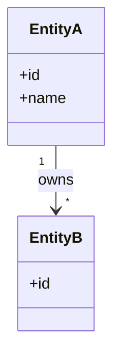

```mermaid
gantt
  title Roadmap
  dateFormat X
  axisFormat %s
  section Phase 1
    {feature-a} :a, 0, 1
    {feature-b} :b, 0, 1
    {feature-c} :c, after a b, 2
  section Phase 2
    {feature-d} :d, after c, 2
```

# Blueprint: {product-name}

<!-- markdownlint-disable single-title -->

## Architecture

> [INSTRUCTIONS]
> Visualize feature dependencies grouped by functional area.

```mermaid
graph TD
  subgraph areaA[{functional-area-a}]
    a[{feature-a}]
    b[{feature-b}]
  end
  subgraph areaB[{functional-area-b}]
    c[{feature-c}]
  end
  c --> a
  c --> b
```

## Data Model

> [INSTRUCTIONS]
> Visualize product domain entities and their relationships.



## Roadmap

> [INSTRUCTIONS]
> Phased implementation with dependency tiers, visualized in a gantt chart. Phases MUST follow `.xe/product.md § Product Strategy`. Features MUST include ID, complexity (Small / Medium / Large), one-sentence purpose, scope boundaries, and dependencies. Built features collapse to a link to the spec.



### Phase 1: {phase-name}

_Strategic intent: one sentence on what this phase achieves._

#### Tier 1.1

- **{feature-a}** — [spec]({feature-a}/spec.md)
- **{feature-b}** (Medium) — _purpose in one sentence_
  - Scope: _what's in / what's out_
  - Dependencies: none

#### Tier 1.2

- **{feature-c}** (Large) — _purpose in one sentence_
  - Scope: _what's in / what's out_
  - Dependencies: {feature-a}, {feature-b}
  - Open questions: _unresolved decisions blocking spec creation_

### Phase 2: {phase-name}

_Strategic intent: one sentence._

- **{feature-d}** (Medium) — _purpose in one sentence_
  - Scope: _what's in / what's out_
  - Dependencies: {feature-c}
