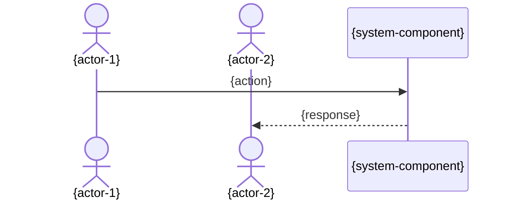

# Customer Journey

> [INSTRUCTIONS]
> Capture product-level workflows showing how actors interact with the product through distinct journeys. This file is optional — omit entirely if no journey mapping has been captured yet.
>
> Use one H2 section per named journey. Common journeys include initialization, blueprint build-out, feature development, onboarding, review, and closure. Add or remove sections as the product's customer journeys evolve; multiple journeys per file are expected.
>
> Each journey section includes:
> - A short textual description (1-3 sentences) explaining what triggers the journey and which actors participate
> - A mermaid sequenceDiagram showing actor interactions, system components, and any human checkpoints
>
> Actors referenced in diagrams MUST be defined in `.xe/product.md § Personas`.

## {journey-name}

> [INSTRUCTIONS]
> 1-3 sentence description: what triggers this journey, which actors are involved, and what the outcome is.

